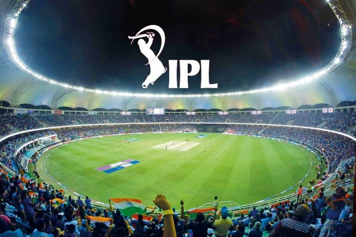
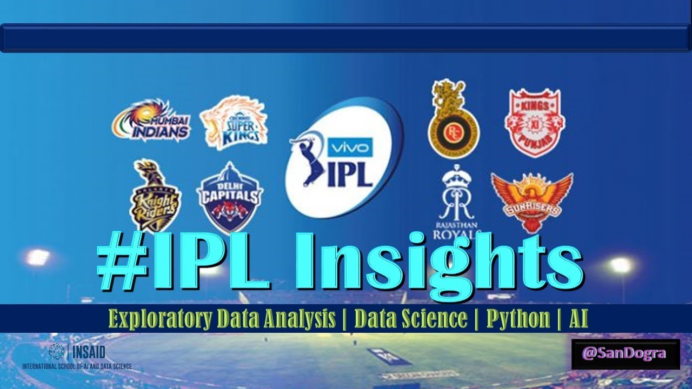
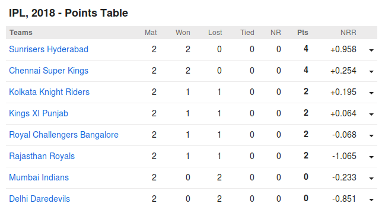
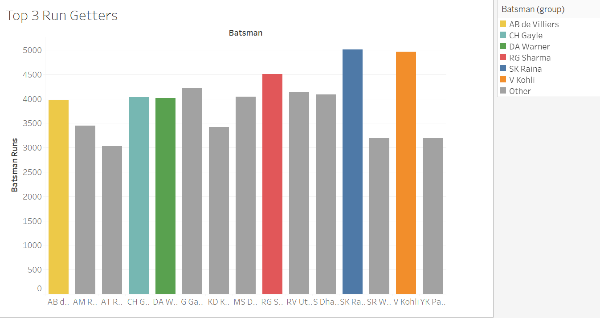

# IPL-Dataset-2008-2019-Analysis

Analysis of IPL dataset ,finding the important information .

+ The Indian Premier League is a professional Twenty20 cricket league in India contested during

March or April and May of every year by eight teams representing eight different cities or states 

in India. The league was founded by the Board of Control for Cricket in India in 2008.

......

# Libraries Used

+ Matplotlib

+ Pandas 

+ Numpy

+ Seaborn

+ Missingo

# Connect With Me Link- https://www.linkedin.com/in/abhishek-singh-771291170/
